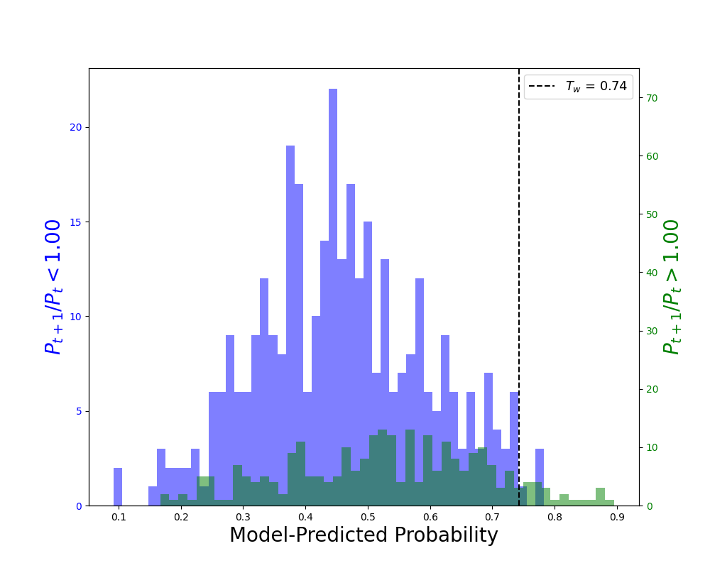
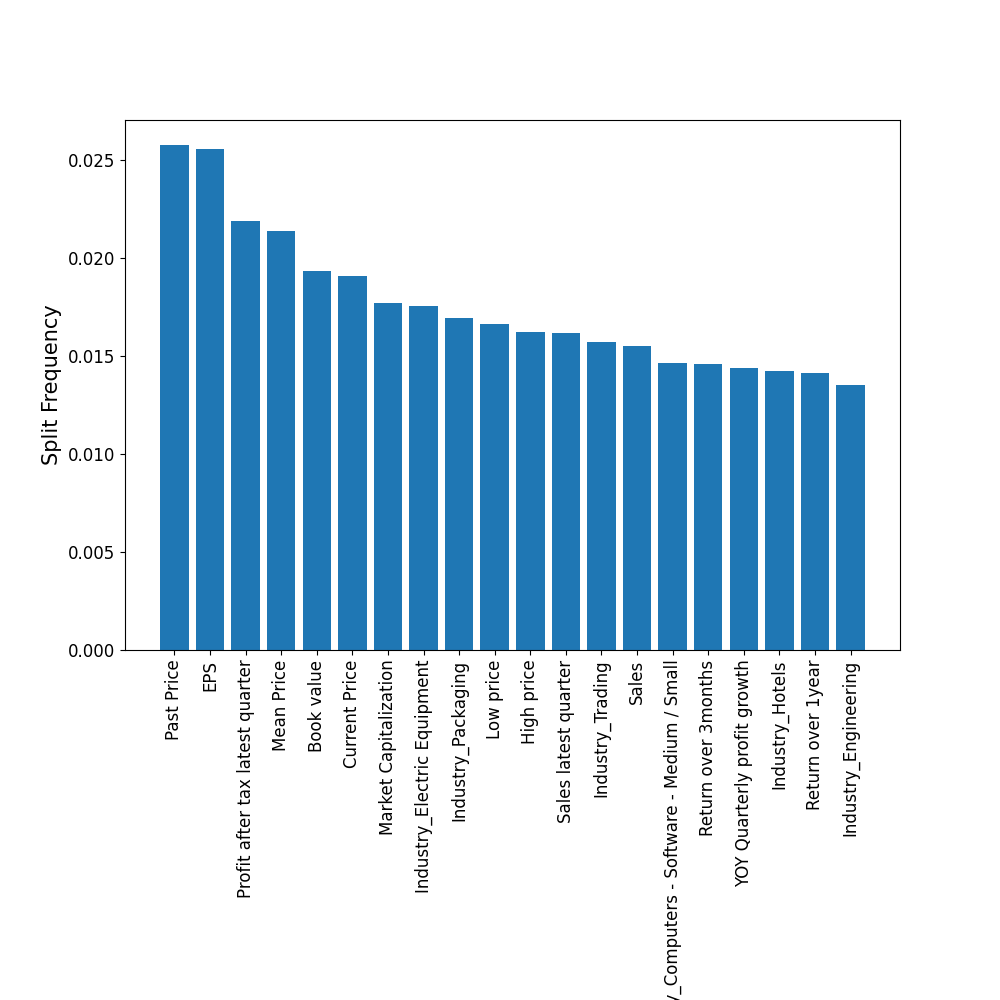

# Machine Learning-Based Stock Selection

## Overview
This project explores the integration of machine learning with fundamental analysis to enhance stock selection strategies. By leveraging historical financial data from NSE and BSE, market indicators, and company-specific metrics, the framework identifies promising investment opportunities using data-driven insights.

## Features
- Combines fundamental analysis with machine learning techniques.
- Analyzes vast financial datasets to uncover hidden patterns.
- Utilizes historical financial data from NSE and BSE, market indicators, and company metrics.
- Provides a systematic and data-driven approach to stock selection.
- Uses XGBoost for predictive modeling and feature importance analysis.

## Technologies Used
- Python
- Machine Learning (XGBoost, Scikit-Learn, TensorFlow/PyTorch)
- Data Processing (Pandas, NumPy)
- Financial Data APIs
- Visualization (Matplotlib, Seaborn)

## Installation
Clone the repository:
   ```bash
   git clone https://github.com/your-repo/ml-stock-selection.git
   cd ml-stock-selection
   ```

## Usage
1. Preprocess financial data and extract relevant features.
2. Train machine learning models, including XGBoost, to analyze stock performance and determine feature importance.
3. Evaluate models and interpret insights for stock selection.

Run the main script:
   ```bash
   python main.py
   ```

## Results

### 7.1: Model-Predicted Probability


Our model effectively identifies winning stocks but struggles with losing ones. Probability-based predictions require balancing precision and recall. In finance, high precision with low recall is preferable, meaning we select fewer stocks but with high confidence.

### 7.2: Importance of Features Ranked


XGBoost allows ranking feature importance. The top feature is past price, while industry features also provide valuable insights into current market performance. Experimenting without industry-based features may yield different outcomes.


## Future Work
- Take financial data across longer time period
- Expand datasets to include alternative financial indicators.
- Improve model interpretability for better decision-making.
